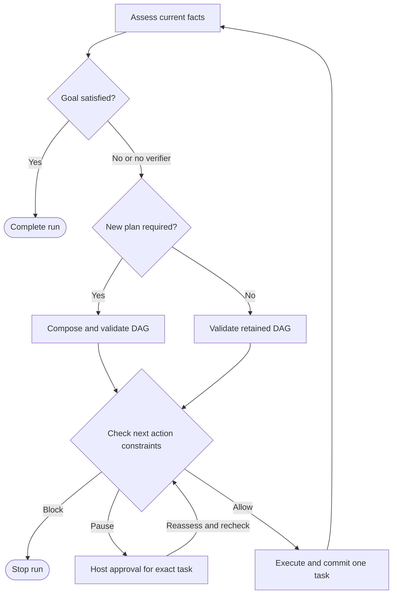

# DAOGraph

_Situation-driven adaptive agent graphs with minimal constraints. Python 3.11+, MIT, alpha 0.2.0._

---

DAOGraph helps research agents decide when to retrieve, investigate a conflict,
replan, and stop. It turns observations into a **Situation**, composes or reuses
an execution DAG, checks execution boundaries, and executes one ready task. A new observation
can insert verification, remove unnecessary work, or replace the remaining path.
The host fixes the goal, registered capabilities, and execution boundaries.

The package has three implementation modules and no runtime dependencies:

| Module | Responsibility |
| --- | --- |
| `graph` | Selective replanning, goal checks, state updates, events, approval checkpoints |
| `situation` | Six scores, named evidence signals, pluggable assessment |
| `constraints` | Step limit, capability allowlist, approval, custom hard rules |

[Architecture](docs/architecture.md) ·
[API reference](docs/api.md) · [Release guide](docs/releasing.md)

Version 0.2.0 implements the [research improvement plan](docs/plans/v0.2.0-research.md).
Read the [research guide](docs/research.md) for evidence rules, benchmark methods,
and the optional online demonstration.

## 🔎 Research and retrieval

Run the conflict example and the frozen offline comparison:

```bash
python examples/adaptive_research.py --trace research-trace.jsonl
python benchmarks/run.py --split evaluation --output benchmark-results
```

The example inserts a conflict review, retrieves an authoritative source, verifies
claims and citations, and returns a supported answer. When evidence remains
insufficient, it returns explicit unresolved keys within a four-read budget.
Known copies are skipped; copies discovered during extraction do not count as
independent sources.

Measured on 36 project-authored, frozen evaluation cases:

| Mode | Correct outcomes | Planner calls | Retrieval attempts |
| --- | --- | --- | --- |
| Fixed workflow | 36/36 | 36 | 105 |
| Always replan | 36/36 | 225 | 105 |
| Selective replan | 36/36 | 138 | 105 |

Selective replanning reduced planner calls by **38.7% against always replanning**.
The fixed workflow was cheaper on these predictable cases. Retrieval counts were
unchanged. These structured scenarios test control behavior; they do not measure
web-search quality, arbitrary language entailment, model cost, or production
performance. See the [full report](benchmarks/results/evaluation.md) and
[methodology](docs/research.md).

Opt into a real read-only HTTPS demonstration, then replay captured evidence:

```bash
python examples/online_research.py --online --capture replay
python examples/online_research.py --replay replay
```

The default uses pinned DAOGraph documentation and a narrow extractor; no model
provider or API key is required. Online runs are separate from the offline gates.

## 🚀 Install and run

Clone the repository and install from source. This version has not been published
to PyPI:

```bash
git clone https://github.com/kai6589c-svg/DAOGraph.git
cd DAOGraph
python -m pip install -e .
python examples/adaptive_research.py
python examples/approval.py
python examples/async_tools.py
```

Install directly from GitHub when you do not need the example files:

```bash
python -m pip install 'git+https://github.com/kai6589c-svg/DAOGraph.git'
```

For development:

```bash
python -m pip install -e '.[dev]'
pytest
ruff check .
ruff format --check .
mypy
python -m build
python -m twine check dist/*
python benchmarks/run.py --split evaluation --output benchmark-results
```

## 🧭 Selective control

The host supplies a relevance decision and a goal check. Both callbacks can be
synchronous or asynchronous:

```python
from daograph import DAOGraph, GoalCheck, Node, Plan, ReplanDecision


def adapt(context, previous_situation, current_plan):
    return ReplanDecision(
        required=bool(context.state.get("new_evidence")),
        reason="Replan only when relevant evidence changes",
    )


def verify_goal(context):
    return GoalCheck(
        satisfied=bool(context.state.get("answer_verified")),
        reason="The host checks whether the required outcome is verified",
    )


graph = DAOGraph(
    goal="Produce a verified answer",
    nodes=(
        Node("observe", lambda context: {"new_evidence": False}),
        Node("answer", lambda context: {"answer_verified": True}),
    ),
    planner=lambda context: Plan.chain("observe", "answer"),
    adapt=adapt,
    verify_goal=verify_goal,
)
assert graph.invoke({}).status == "completed"
```

The first and exhausted plans always invoke the planner. Reused plans still pass
validation and every action still passes constraints. A satisfied goal check can
stop pending work. An exhausted newly composed plan with an unsatisfied goal
returns `incomplete`.

`adapt=None` keeps planning after every assessment; `verify_goal=None` keeps the
0.1.0 completion semantics. Approval resume executes the exact approved pending
action before these optional controls run again.

## 🎯 A small working agent

A planner returns the DAG for the current situation. Completed task ids keep their
identity across replans. Each node returns a partial state update.

```python
from daograph import Context, DAOGraph, Node, Plan, Situation, SituationEngine


def assess(state, previous):
    conflict = state.get("conflict", False) and not state.get("verified", False)
    return Situation(
        uncertainty=0.85 if conflict else 0.1,
        evidence=("Conflicting observations" if conflict else "Evidence resolved",),
    )


def research(ctx: Context):
    return {"conflict": True, "sources": ["A", "B"]}


def verify(ctx: Context):
    return {"verified": True}


def answer(ctx: Context):
    return {"answer": "Checked against both sources"}


def planner(ctx: Context):
    if ctx.state.get("answer"):
        return Plan(reason="Answer delivered")
    if ctx.situation.uncertainty >= 0.6 or ctx.state.get("verified"):
        return Plan.chain("research", "verify", "answer", reason="Verify the evidence")
    return Plan.chain("research", "answer", reason="Start with a short path")


graph = DAOGraph(
    goal="Give a supported answer",
    nodes=(Node("research", research), Node("verify", verify), Node("answer", answer)),
    planner=planner,
    situation=SituationEngine(assess),
)
result = graph.invoke({"question": "Which source is correct?"})
assert result.status == "completed"
assert result.completed == ("research", "verify", "answer")
print(result.state["answer"])
```

The demo deliberately uses deterministic observations. Replace the callback bodies
with your search, model, database, or other tool calls. A planner or assessor may
also be async and model-backed; the core does not depend on a model provider.

## 🔄 The control loop



Assessment happens before the first task and after every successful task. By
default, planning follows each assessment. Optional adaptation can retain an
unfinished plan. The runtime executes the first ready task in plan order and
commits its update atomically. Completed task ids prevent accidental replay.

DAG roots are sequential in 0.2.0. Fan-in dependencies are supported; parallel
execution within one run is outside this release. Independent async runs can
execute concurrently.

## 📊 Situation

| Signal | Default | Interpretation of larger values |
| --- | ---: | --- |
| `risk` | 0.0 | Greater estimated harm |
| `uncertainty` | 0.5 | Less reliable knowledge |
| `urgency` | 0.0 | More time pressure |
| `reversibility` | 1.0 | Easier to undo |
| `resource_pressure` | 0.0 | Fewer remaining resources |
| `trust` | 0.5 | More trusted evidence |

All scores must be finite numbers in `[0, 1]`. `evidence` records the reasons for
an assessment. The default engine reads the complete `state["signals"]` mapping;
missing fields use the defaults above. It does not infer risk from arbitrary text.
Supply a domain assessor to interpret facts and history. Scores and label
thresholds are explicit estimates, without a claim of statistical calibration.

Optional `Situation.signals` contains named `Signal(name, value, evidence)`
records. Values are finite numbers in `[0, 1]` or `None` for unknown. The research
application reports coverage, conflict, independent support, freshness, and new
information; they are application heuristics, not calibrated probabilities.

The planner decides how each signal affects topology. The runtime does not assume
that increasing urgency permits bypassing a constraint, or that increasing
uncertainty always warrants another expensive model call.

## 🛡️ Minimal constraints and approval

`Constraints()` supplies a 32-task execution limit. `allowed_nodes` optionally
narrows the registered capabilities. `rules` adds small synchronous callbacks
that return `Decision.allow()`, `.pause(reason)`, or `.block(reason)`.

A node marked `side_effect=True` pauses if effective risk is at least `0.7` or
effective reversibility is at most `0.3`. Effective risk is the larger of the
situation and node risk; effective reversibility is the smaller of the two.
`requires_approval=True` pauses any node. Read-only investigation is allowed even
when situation risk is high. Hard blocks always win over approval.

```python
from daograph import Checkpoint, Context, DAOGraph, Node, Plan


def publish(ctx: Context):
    return {"receipt": "simulated"}  # Replace with an authorized external API.


graph = DAOGraph(
    goal="Publish an approved release",
    nodes=(Node("publish", publish, side_effect=True, reversibility=0.1),),
    planner=lambda ctx: Plan.chain("publish"),
)
paused = graph.invoke({})
assert paused.status == "paused"
saved = Checkpoint.from_json(paused.checkpoint.to_json())

# The host supplies this only after its own approval/authentication flow.
result = graph.resume(saved, approval=saved.interrupt.id)
assert result.status == "completed"
```

Writable state cannot grant approval or change the goal and constraints. On
resume, the runtime reassesses the situation, rechecks constraints, and runs the
exact pending task. A changed assessment invalidates the old approval if the
current decision still requires approval. A grant covers one task only.

Checkpoints and approval ids are trusted host data, not signed credentials. The
host must protect storage, authenticate approvers, serialize resumes, and retire
consumed checkpoints. Reusing the same saved checkpoint can repeat an external
effect. Use idempotency keys in effectful tools. Python callbacks run with host
permissions; DAOGraph is not a code sandbox. These boundaries are described in
[the architecture document](docs/architecture.md).

## 🔧 Streams, async calls, and state

```python
for event in graph.stream({}):
    print(event.kind, event.message)

# In an async application:
# result = await graph.ainvoke({})
# async for event in graph.astream({}):
#     ...
# result = await graph.aresume(saved, approval=saved.interrupt.id)
```

State must contain JSON-compatible data. Callbacks receive deeply read-only
snapshots; arrays appear as tuples. Partial updates replace top-level keys.
Optional `reducers={"messages": operator.add}` accumulates selected keys when a
previous value exists. A patch commits atomically after every reducer and value
validates. Node failures produce `Result(status="failed")` and are not retried.
Cancellation propagates to the caller. Cancelling an await does not forcibly stop
an already running synchronous callback thread.

Terminal statuses are `completed`, `paused`, `blocked`, `failed`, and the opt-in
`incomplete`. With a verifier, `completed` means its goal check passed; without
one, it retains the original no-unfinished-tasks meaning. A paused run includes a serializable
approval checkpoint. Stream events expose state snapshots, plans, and situation
assessments, so stream consumers should receive only data they are authorized to
read.

## 📚 Relationship to LangGraph

LangGraph already supports conditional edges, dynamic routing through `Command`,
and durable interrupt/resume mechanisms.[^1][^2] DAOGraph's distinction is its
small default control contract: explicit situation assessment and reconstruction
or selective reuse of the transient execution DAG after observations, with
optional host-defined goal checks. It is an independent
implementation, with no LangGraph dependency and no API compatibility claim.

This alpha release includes DAG validation, sync/async calls, incremental event
streams, reducers, minimal constraints, and JSON approval checkpoints. Production
crash recovery, exactly-once effects, distributed scheduling, automatic retries,
intra-run parallelism, and a provider integration catalog are outside 0.2.0.

## 🤝 Contributing and license

See [CONTRIBUTING.md](CONTRIBUTING.md) for the local quality checks and contribution
scope. New features should preserve the three-module core. DAOGraph is distributed
under the [MIT License](LICENSE).

[^1]: LangChain. [Graph API overview](https://docs.langchain.com/oss/python/langgraph/graph-api).
[^2]: LangChain. [Interrupts](https://docs.langchain.com/oss/python/langgraph/interrupts).
