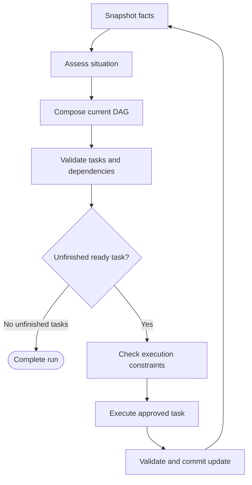

# DAOGraph architecture

_The control contract and implementation boundaries for version 0.1.0._

---

## 🎯 Design contract

The host owns the goal, node registry, assessment callback, planner, reducers, and
constraints. The agent may propose transient plans and state updates through
those callbacks. State updates cannot replace host configuration. The public
configuration dataclasses are frozen; state snapshots are recursively read-only.

The architecture adds two concepts to a small graph runtime: an explicit
`Situation` and minimal `Constraints`. Planning and execution remain functions in
`graph.py`. There are no separate policy, role, strategy, adapter, memory, or
budget packages.

## 🔄 Assessment and execution

Each iteration assesses current facts and the previous situation. The planner
receives the fixed goal, facts, current situation, and successful execution
history. It returns a transient DAG whose task ids identify individual work
occurrences. The runtime validates the plan and executes the first ready task in
plan order. After the update commits, it immediately reassesses and replans.

A full plan may include completed tasks. Their ids prevent re-execution and their
node/dependency definitions cannot change. The planner may also return only the
remaining tasks, referring to completed ids as external dependencies. A dropped
unfinished task has no execution history and may be reintroduced later.

Repeated use of a node requires a fresh task id, such as `search:2`. This makes
iteration explicit and bounded by `max_steps`. `Plan.chain()` uses node names as
task ids and is intended for chains without repeated node names.

DAG construction rejects cycles and duplicate ids. Runtime validation rejects
unknown nodes, missing dependencies, and redefined completed tasks. Multiple
ready roots run sequentially; the entire pending graph is reconsidered after each
root returns. There is no automatic parallel scheduling inside one run.

## 📊 Situation assessment

`Situation` contains six normalized estimates and optional evidence. No signal is
silently inferred from user prose. The default assessment is an explicit signals
bridge; applications provide an assessor that interprets their own observations.
The research example derives uncertainty from source disagreement.

An assessor may be synchronous or asynchronous and may use a model. Its output
must pass numeric validation. Invalid assessments stop the run before any task.
The runtime does not validate whether the assessor's estimates are epistemically
correct. Applications should measure assessment quality on their own domain.

The planner chooses how situation affects topology. Constraints independently
choose whether a selected action is permitted. Urgency and low uncertainty cannot
authorize an otherwise blocked action.

## 🛡️ Minimal authority boundary

A constraint check runs immediately before each action. The built-in checks are:

| Check | Outcome |
| --- | --- |
| Executed-task budget exhausted | Block |
| Node outside the optional allowlist | Block |
| Explicit approval required | Pause |
| Side-effect risk or irreversibility threshold exceeded | Pause |
| Custom synchronous rule | Allow, pause, or block |

A node's declared risk cannot be lowered by a situation assessment. Its declared
irreversibility cannot be improved by an optimistic assessment. Read-only tasks
may continue investigating high-risk situations. Custom hard blocks override all
approval requests and existing grants.

A paused result records facts, situation, successful history, the exact pending
plan, and an interrupt id. Approval must be supplied as a `resume` argument by the
host. A state key that claims approval has no effect on the built-in gate.

Resume validates the graph definition signature, reassesses the saved facts, and
rechecks the constraints. It does not run the planner before the pending action,
so an approval cannot silently be redirected to another task. If the assessment
changes and the action still requires approval, it emits a new interrupt. After
that task completes, the ordinary assessment/replanning loop resumes and the
grant is discarded.

The signature includes the goal, revision, registered node metadata, constraint
configuration, and callback names. It is a compatibility check, not a code hash
or a cryptographic signature. Hosts must bump `revision` after changing callback
behavior or captured configuration and reconstruct the same callbacks when
loading a checkpoint in another process.

## 💾 State and observability

Facts must be JSON-compatible: string-keyed objects, arrays, strings, finite
numbers, booleans, and null. Callback snapshots use mapping proxies and tuples.
Node patches replace top-level keys unless the host configures a reducer.
Reducers receive copies of the old and new values. The whole patch commits only
after all reducers finish and all values validate.

`node_end` contains the updated facts and the situation used to select that
node. The following `situation` event contains the new assessment. The `plan`
event exposes the transient DAG and its reason. A terminal event holds a
`Result`. No implicit retry occurs after a callback failure. Cancellation
propagates; a cancelled await cannot forcibly terminate synchronous worker code.

A `completed` result means the planner left no unfinished tasks. Goal truth is an
application responsibility. Add a verification task or inspect completion in the
planner when the application needs a stronger semantic contract.

## 🔒 Trust and release scope

The runtime assumes trusted Python callbacks and trusted host-controlled
checkpoints. It does not isolate arbitrary Python, authenticate reviewers, sign
checkpoints, enforce OS permissions, or prevent replay of a saved checkpoint.
Callbacks can reach host resources directly, so capability checks govern the
runtime's dispatch rather than all code behavior.

Applications must serialize approval resumes, retire consumed checkpoints, and
use idempotency keys for external effects. A process crash after an external
operation but before a state commit can leave the outcome uncertain. 0.1.0 saves
approval checkpoints only; it does not provide durable journaling after every
operation, recovery of in-flight tools, or exactly-once execution.

The step budget counts successful graph tasks. It does not meter internal model
calls, tokens, wall time, or money inside a callback. Resource pressure is an
assessment signal; custom rules and application tools can impose additional
limits when needed.
