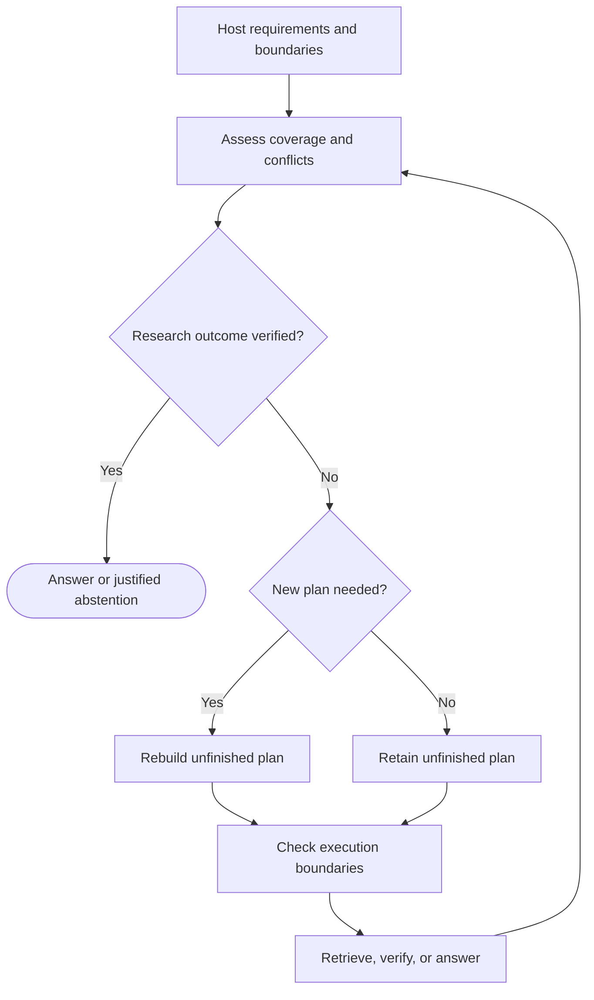

# DAOGraph 0.2.0: Evidence-driven research

_An improvement plan dated 2026-10-05, implemented in 0.2.0. The original targets
below are preserved; see the [research guide](../research.md) for measured outcomes
and implementation details._

---

## 🎯 Product outcome

Keep goals and execution boundaries explicit. Adapt execution to changing evidence.
Concentrate the project on one user problem and demonstrate progress with
repeatable results.

The first audience is Python developers building research and retrieval agents.
Their problem is deciding whether to retrieve more information, verify a conflict,
answer, or stop with an honest statement of insufficient evidence. A useful agent
must also avoid redundant searches and repeated planning that do not improve its
answer.

The proposed positioning is:

> DAOGraph helps research agents decide when to investigate, verify, replan, and
> stop as evidence changes, within host-defined execution boundaries.

Version 0.2.0 will demonstrate this behavior on a small, inspectable research
application. The research policy is a reference application, not a universal
truth detector. Improvements in quality, planner calls, or tool calls must be
measured against the baselines below before they appear as release claims.

### Release boundaries

- Keep exactly three implementation modules: `graph`, `situation`, and `constraints`;
  `__init__` remains the public export surface.
- Keep the core independent of model providers and free of third-party runtime
  dependencies. Research helpers, fixtures, and benchmark code stay outside the core.
- Keep all public documents, comments, messages, fixtures, and examples in English.
- Retain Python 3.11–3.14 support and the existing Linux, macOS, and Windows CI matrix.
- Exclude a general agent platform, vector database integration, hosted UI,
  distributed execution, automatic retries for side effects, and signed approval
  infrastructure from this release.

## 📋 Starting point and selected approach

The current runtime reassesses and replans after every successful task. The default
assessor reads explicitly supplied situation scores. Task identities and immutable
configuration already protect execution history, goals, and dispatch boundaries.
A run is considered complete when its planner leaves no unfinished work.

The selected approach adds optional control callbacks to the existing runtime and
ships a research application with evidence-based assessment. Existing applications
keep their current behavior unless they opt into the new callbacks.

| Improvement | User benefit | Implementation location |
| --- | --- | --- |
| Evidence-based research assessment | Understand what triggered investigation | `situation` types and research application |
| Selective replanning | Avoid unnecessary planner calls | `graph` |
| Explicit goal verification | Separate success from running out of work | `graph` |
| Retrieval failure observations | Change source when a read operation fails | Research application |
| Decision and plan-change events | Explain why execution changed | `graph` and example trace output |
| Reproducible comparison | Check the claimed benefit independently | Benchmark fixtures and runner |

Alternatives considered were a larger general-purpose orchestration release and
an immediate integration layer for other frameworks. Both would expand the work
before this research behavior has been evaluated. Optional integrations can follow
once the control contract has demonstrated value.

## 🔧 Runtime interfaces and behavior

### Selective replanning

Add a frozen `ReplanDecision(required: bool, reason: str)` type in `graph` and an
optional `adapt` callback on `DAOGraph`:

```text
adapt(context, previous_situation, current_plan) -> ReplanDecision
```

Append new optional configuration fields after the existing fields, preserving
existing positional arguments. Support synchronous and asynchronous callbacks.
`adapt=None` preserves the 0.1.0 behavior of planning after each assessment. The first plan and an exhausted plan
always require the planner; the callback cannot prevent them from being composed.
After an ordinary successful task, the callback decides whether to replace the
remaining plan or reuse it. Reuse still validates the plan against registered
nodes and successful task history.

Hard constraints run immediately before every action, including actions from a
reused plan. A reuse decision cannot override an allowlist, approval gate, or
executed-task limit. Completed task definitions remain immutable. A repeated node
still requires a fresh task id.

### Explicit goal verification

Add a frozen `GoalCheck(satisfied: bool, reason: str)` type and an optional
`verify_goal` callback:

```text
verify_goal(context) -> GoalCheck
```

Support synchronous and asynchronous callbacks. In ordinary execution, evaluate
the callback after situation assessment and before selecting more work. When it
returns a satisfied check, finish without executing unnecessary pending tasks.
When the newly composed plan has no unfinished work and the check is unsatisfied,
return `Result(status="incomplete")` with the check reason. Invalid callback
outputs fail the run before dispatch.

Append optional `goal_check` data to `Result`, preserving existing positional
fields. `verify_goal=None` preserves the current completion semantics. The new
`incomplete` status is returned only by applications opting into verification.
A hard boundary continues to produce `blocked`; a callback error continues to
produce `failed`.

### Trace contract

Add these events without removing existing kinds:

- `adaptation`: records the required/reuse decision and its reason.
- `plan_reused`: records that the unfinished plan was retained.
- `goal_check`: records the host verifier's result.
- `incomplete`: terminal event containing an incomplete result.

Append optional typed adaptation, goal-check, and plan-change fields to `Event`.
A plan change contains sorted tuples of added, removed, and changed unfinished
step ids. Exclude completed tasks from the comparison; changing a completed
signature remains an error. Emit the change on the existing `plan` event after
validation. Reused plans have no change record.

The research examples write English JSONL traces using these events and the
existing context. Each trace connects an observation, an assessment, a control
decision, the changed tasks, and the eventual answer or abstention. Timing data is
informational and does not determine deterministic benchmark results.

### Checkpoints and compatibility

Keep approval checkpoint schema 1 and the current approval behavior. Resuming a
checkpoint rechecks authority and executes the exact pending approved action
before normal adaptation and goal verification resume. A planner or adapter
cannot redirect the approval.

Include non-null `adapt` and `verify_goal` callback identities in the graph
compatibility signature. When both are absent, retain the original signature
construction so default 0.1.0 checkpoints remain compatible with the same graph
and revision. Document that behavior changes in any host callback still require
a revision bump. Checkpoints remain trusted host data; consumption and effect
idempotency remain host responsibilities.

## 📊 Evidence-driven research application

### Evidence representation

Use ordinary JSON-compatible application state, with the following research data:

| Object | Required information |
| --- | --- |
| Task | Question, required claim keys, optional effective date |
| Source | Id, origin group, URL or fixture reference, observation date, authority metadata |
| Claim | Claim key, normalized value, source id, supporting excerpt |
| Retrieval attempt | Query, requested source, outcome, returned evidence ids |
| Answer | Supported or insufficient-evidence status, claims, citations, unresolved keys |

Host configuration owns the question's required keys, accepted authority levels,
and retrieval budget. Retrieved documents cannot modify those settings. Required
claim keys describe what must be investigated; they do not contain the expected
answers.

A source's origin group identifies copied or syndicated material. Multiple
copies from the same origin count once. Normalized claims are deliberately
structured in the offline corpus; the benchmark does not claim to validate
arbitrary natural-language entailment.

### Assessment and decisions

Keep the six existing situation scores. Append an optional tuple of named
`Signal` records in `situation`, each with a name, a numeric value or `None`, and
English evidence references. Validate finite normalized values when present.
`None` explicitly means unknown. The new field defaults to an empty tuple,
serializes optionally, and loads missing data from older checkpoints.

Research assessment provides these signals:

- `coverage`: fraction of required claim keys with retrieved evidence.
- `conflict`: fraction of covered keys with unresolved competing values.
- `independent_support`: fraction of required keys meeting the support rule.
- `freshness`: fraction of required keys with current evidence when time matters.
- `new_information`: whether the latest retrieval introduced a new relevant value,
  independent origin, or current source.

Do not average these signals into a universal confidence score. The policy uses
coverage and unresolved conflicts directly. Situation uncertainty follows the
largest evidence gap; scores are explicit heuristics. Human-readable evidence
records identify the documents responsible for the assessment.

The reference policy operates as follows:

1. Retrieve a ranked source for uncovered claim keys.
2. When relevant sources conflict, request a different independent origin or a
   host-recognized authoritative current source, then verify the affected keys.
3. Treat a supported claim as either two independent current origins agreeing,
   or one host-recognized authoritative current source. A current authoritative
   source may resolve a lower-authority or stale conflict; unresolved peer conflicts
   prevent a supported answer.
4. Produce a source-linked answer when every required key satisfies the support
   rule. Otherwise produce an explicit insufficient-evidence answer after the
   retrieval budget or available candidates are exhausted.
5. Do not repeat an identical query/source pair or fetch another copy from an
   already exhausted origin solely to increase source count.

The verifier accepts a supported answer only when its values, excerpts, and source
ids agree with observed evidence. It accepts an insufficient-evidence answer only
when it names unresolved keys and the observed retrieval state justifies stopping.
This acceptance makes an honest abstention a valid research outcome; the benchmark
separately measures whether that abstention was correct for the task.

Use a maximum of four retrieval attempts and an eight-task runtime limit in all
benchmark modes. Reserve enough tasks for verification and the final answer;
the application must reach a supported answer or justified abstention before the
hard runtime limit is exceeded. One retrieval task makes at most one external read.
Verification and answer generation use deterministic application functions in the offline
suite. These limits measure this application and do not claim to meter arbitrary
calls made inside user callbacks.

Selective replanning is triggered by newly covered keys, a relevant conflict,
changed independent support, relevant freshness changes, recoverable retrieval
failure, or exhaustion of the current plan. A duplicate observation that changes
none of these facts retains the plan. Derived scores and changes in explanatory
wording alone do not trigger replanning.

### Failure handling

Timeouts, missing sources, and empty results from read-only retrieval are recorded
as application observations. They consume a retrieval attempt, mark that candidate
as unavailable for the run, and allow the planner to choose another source.
Programming errors still fail the run. No blanket exception swallowing or
automatic retry of effectful nodes is introduced.



## ✅ Offline benchmark and acceptance criteria

### Corpus and baselines

Create 48 English, project-authored scenarios under the project license: eight
variants in each of six families. Assign two variants per family to development
and six to evaluation, yielding 12 development and 36 frozen evaluation cases.
The families are consistent evidence, resolvable conflict, stale evidence,
syndicated duplicates, unavailable retrieval, and insufficient evidence.

Place expected answers and expected abstentions in scorer-only records. Policies
receive the question and retrieved evidence, not expected labels or unretrieved
corpus contents. Use the same deterministic token-overlap retriever, stable
source-id tie breaking, source ordering, support rules, and hard limits in every
mode. The runner records every attempted tool call and every planner invocation.

Compare three modes:

| Mode | Control behavior |
| --- | --- |
| Fixed workflow | Predetermined retrieval depth, then verification and answer |
| Always replan | Same research planner invoked after every observation |
| Selective replan | Same planner invoked only on the defined relevant changes |

Choose fixed retrieval depth from two, three, or four using development cases:
highest correctly resolved outcome rate, then lowest retrieval count, then lowest
depth. Freeze that choice before evaluation and also report every candidate's
results. Always-replan and selective-replan modes use the same assessment,
verification, and stopping policy, so differences reflect the planning trigger.
Do not retune on the evaluation cases or hide failed cases.

### Metrics and release gates

Report per-case and per-family outcomes, correctly supported answers, correct
abstentions, unsupported assertions, citation validity, retrieval attempts,
planner invocations, duplicate retrievals, and elapsed time. Distinguish a
completed control loop from a correct research result. An answerable question
with an abstention is not scored as a successful resolution.

The following are release targets, not measured results:

- No incorrect supported assertion or invalid citation in the frozen suite.
- Correctly resolve every case's authored answer-or-abstention expectation.
- Match always-replan outcome quality and do no worse than the development-selected
  fixed baseline on correctly resolved outcomes.
- Reduce aggregate planner invocations by at least 30% relative to always-replan.
- Make zero duplicate identical query/source requests; use no more retrieval
  attempts than always-replan in aggregate.
- Repeated offline runs produce identical answers, event decisions, and count
  metrics; elapsed time and run ids are excluded from equality checks.
- Pass the existing tests, new sync/async control tests, Ruff, strict Mypy, and
  distribution installation checks. Keep statement coverage at least 90%.

If a target fails, report the failure and revise the policy or narrow the release
claim. Do not change evaluation labels or weaken the threshold after seeing the
results. This corpus is an application behavior suite; it is not evidence of
universal retrieval quality or real-world cost savings.

### Required test scenarios

Cover goal satisfaction with unfinished work; empty plans with unmet goals;
forced planning when the current plan is exhausted; plan reuse with a newly denied action;
new conflicts that insert verification; duplicate evidence that retains the plan;
completed task identity preservation; exhausted retrieval with an honest abstention;
recoverable read failures; malformed callbacks; cancellation; approval resume;
and old default checkpoint compatibility.

Add a frozen-corpus integrity hash, tests that policies never receive scorer
labels, and a machine-readable result artifact. CI runs the offline suite without
network access or credentials and uploads JSON results plus an English Markdown
report. Network denial applies to the benchmark process, not to dependency
installation in the surrounding CI job. Online outcomes never determine the
offline release gate.

## 🌐 Optional online demonstration

Ship one read-only online example using `urllib` to fetch HTTPS UTF-8 text or
Markdown from a host-configured source list. Use DAOGraph's versioned README and
API documentation, initially pinned to `v0.1.0`, as the default source list and a
documented question about its public approval behavior. Include an explicit
`--ref` option and record the resolved source revision in replay metadata. Treat documents from the same repository as one origin;
source authority comes from host configuration.

Display retrieved excerpts, source links, plan decisions, and the final outcome.
A small question-specific extractor supports the default demonstration; document
its limited extraction scope. Allow developers to supply their own claim-extraction
callback, including a model-backed one. No provider SDK, API key, or model call is
required by the default online example.

Use a ten-second network timeout and a one-MiB response limit per source. Save
responses and source metadata to an optional local replay directory, including
content hashes. A replay reads those captured responses without making network
requests. Online source changes and timing are reported separately from the
frozen benchmark. HTTP failures become read-failure observations; online CI calls
remain opt-in and manual.

## 🚀 Delivery sequence and publication

| Milestone | Deliverable | Exit condition |
| --- | --- | --- |
| 1. Lock the evidence contract | Development corpus, scoring rubric, fixed baseline | Source provenance and outcome rules reviewed |
| 2. Add control callbacks | Adaptation, goal checks, event changes, compatibility tests | Existing applications retain default behavior |
| 3. Build the research application | Assessor, planner, verifier, bounded retrieval | All six development families behave correctly |
| 4. Freeze and evaluate | Evaluation integrity hash, runner, reports | Published targets pass without evaluation retuning |
| 5. Add online replay | Real HTTPS reads, cited extracts, replay instructions | Manual smoke test and offline replay pass |
| 6. Release 0.2.0 alpha | English docs, CI artifacts, wheel and source archive | Exact release commit passes CI and package checks |

The implementation should use a feature branch and a pull request linked to this
plan. Document callback defaults, the optional `incomplete` status, research support
assumptions, and benchmark limitations in the README and API documentation. Include
one complete example, one execution trace showing a conflict-driven change, and
measured benchmark tables. Do not describe a planned feature as already available.

Only after the implementation and release gates pass, update both package version
locations to `0.2.0`, add a changelog entry, tag `v0.2.0`, and publish an alpha
GitHub Release with CI-built distributions, the frozen corpus hash, and the
benchmark report. PyPI publication is outside this plan.

## 📦 Implementation notes

The implementation separates conflict review, claim resolution, citation checks,
and answer writing within the eight-task limit. Known copies have explicit host
provenance metadata; unrecognized copies can still be observed and assessed.
The CLI resolves the online source revision before graph execution and records
it for replay. All frozen acceptance targets passed. The measured selective
planner reduction is 38.7% against always-replan; fixed workflows were cheaper on
this controlled corpus. See the [research guide](../research.md) for limitations.

## 📚 Follow-up decisions

A general provider integration catalog, compatibility adapters for other agent
runtimes, learned score calibration, approval-scope redesign, broad monetary
budget accounting, and parallel task execution remain follow-up work. Reconsider
them when external usage of the research application demonstrates a specific
need. Keep the next release focused on the measurable research problem above.
