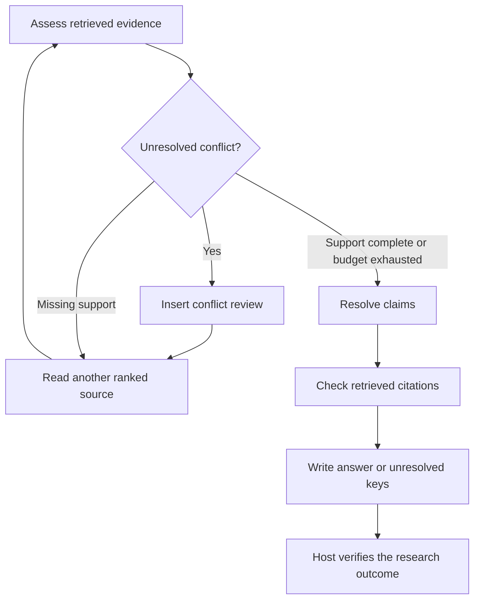

# Research and retrieval with DAOGraph

_The 0.2.0 reference application, evaluation method, and online demonstration._

---

## 🎯 Application contract

The host fixes a question, required claim keys, optional effective date, source
provenance, and a retrieval budget. Documents provide observations. They cannot
change requirements, authority, budgets, or approvals. `examples/research.py` is
an inspectable application outside the three-module core, not a universal truth
or natural-language entailment system.

Each source has an id, origin group, URL, title, date, and host-defined authority.
An optional `duplicate_of` marks a known copy, which is excluded from retrieval.
Otherwise extraction may reveal copied evidence from the same origin; it counts
once for independent support. Known-copy exclusion assumes the original is the
configured candidate; source failover for those copies is follow-up work.

Claims contain a required-key identifier, normalized value, and supporting
excerpt. Sources are ranked by question/title token overlap with stable id tie
breaking. Unretrieved document bodies and expected answers never enter planning.
The example does not use embeddings, a model, or a hosted search service.

## 🔄 Decisions and stopping

The assessor reports coverage, unresolved conflict, independent support, freshness,
and new information as named signals. Unknown freshness is `None`. Uncertainty
follows the largest evidence gap; none of these scores is a calibrated probability.



A current host-authoritative source supports a value; otherwise two independent
current origins must agree. Conflicting peer authorities prevent support.
Authoritative current evidence can supersede stale or lower-authority evidence.
A non-temporal task does not require a date cutoff. These are explicit application
rules, not general guarantees about truth or source authority.

Relevant new values, independent origins, freshness, and recoverable read failures
trigger replanning. An unchanged duplicate observation retains unfinished work.
Claim resolution, citation checks, and answer writing are separate tasks; their
state changes do not warrant another evidence plan. New conflicts insert a
`review` task showing competing observed values before further retrieval.

Every mode has at most four reads and eight successful graph tasks, including
conflict review, claim verification, citation verification, and answer generation.
No identical query/source pair is repeated. Timeouts, missing sources, empty reads,
and HTTP errors consume a read attempt and permit another source. Unexpected
programming or extraction errors fail the run.

A supported answer contains values and matching observed excerpts and source URLs.
An insufficient-evidence answer names unresolved keys and is accepted only when
the read budget or available candidates are exhausted. A justified abstention can
be a completed control outcome; the scorer separately checks whether it was the
correct outcome. Answerable cases with abstentions do not count as correct.

## 🚀 Run the offline example

From a repository checkout, after `python -m pip install -e .`:

```bash
python examples/adaptive_research.py --trace research-trace.jsonl
python benchmarks/run.py --split development --output benchmark-results
python benchmarks/run.py --split evaluation --output benchmark-results
```

The conflict example reads two disagreeing sources, inserts a review, and reads
an authoritative source. Its [captured execution trace](traces/research-conflict.jsonl)
connects source observations, assessments, adaptation, task changes, and the
supported answer. The runtime checks constraints before every action, including
those retained from an earlier plan.

## 📊 Frozen benchmark

The corpus contains 48 project-authored English structured scenarios: eight
variants each for consistent evidence, conflict, stale evidence, duplicates,
unavailable reads, and insufficient evidence. Two variants per family are for
development; the remaining six are frozen evaluation cases. Variants perturb
values and source conditions around the same single-claim task. They are controlled
behavior checks, not 36 independent real-world research questions.

The scorer loads `benchmarks/expected.json`; application construction receives
only requirements, source metadata, and a read callback. Corpus bodies become
visible through requested reads. `benchmarks/lock.json` records file SHA256 hashes
and the development-selected baseline. A changed corpus or scorer-label file
fails integrity verification. The freeze command refuses to overwrite a lock.

Three modes share the same retriever, support rules, verifier, sources, and budgets:

| Mode | Planning policy |
| --- | --- |
| Fixed | One initial plan, bounded predetermined retrieval depth, then verification and answer |
| Always | Recompose after every task while the goal remains unsatisfied |
| Selective | Recompose on relevant evidence changes; reuse verification and answer tasks |

Fixed depth is selected from 2, 3, and 4 using development outcome quality, then
retrieval count, then lower depth. The selected depth is 4. Reports include all
candidate depths on both splits; evaluation never changes the selected baseline.
The fixed control mode can return `incomplete` for premature abstention while
retrieval budget remains, which counts as an incorrect outcome.

Measured frozen evaluation results:

| Mode | Expected outcomes | Planner calls | Reads | Unsupported assertions | Invalid citations |
| --- | --- | --- | --- | --- | --- |
| Fixed | 36/36 | 36 | 105 | 0 | 0 |
| Always | 36/36 | 225 | 105 | 0 | 0 |
| Selective | 36/36 | 138 | 105 | 0 | 0 |

Selective planning uses 38.7% fewer planner invocations than always replanning.
All modes have identical retrieval counts; fixed control uses fewer planner calls
than either adaptive mode. This result supports avoiding unnecessary replanning
within an adaptive controller. It does not establish superiority over fixed
workflows, production reliability, web retrieval quality, or monetary savings.
No model or token usage is measured.

See the [evaluation report](../benchmarks/results/evaluation.md) and
[development report](../benchmarks/results/development.md). Full generated JSON
contains per-case/per-family results, all candidate depths, traces, counts, and
hashes. CI uploads JSON and Markdown; releases include the evaluation artifacts.
Elapsed times are informational. Every mode/case runs twice and compares answers,
decisions, and count metrics exactly.

The benchmark process denies network connections and DNS resolution while
allowing asyncio's internal socket pair. It uses no credentials. This guard catches
accidental network use in trusted benchmark code; it is not a Python security
sandbox. CI dependency installation occurs before network denial. Offline gates
check all expected outcomes, zero unsupported assertions and invalid citations,
quality relative to both baselines, at least 30% planner reduction against always,
zero duplicate requests, no increase in reads against always, and deterministic
repetitions. Online results never determine these gates.

## 🌐 Optional online demonstration and replay

```bash
python examples/online_research.py --online --capture replay --trace online-trace.jsonl
python examples/online_research.py --replay replay --trace replay-trace.jsonl
```

The default question is “Does an approval id authenticate the approver?” Sources
are DAOGraph's API documentation and README, pinned to `v0.1.0`. They share one
origin and are authoritative by explicit host configuration. `--ref` selects a
Git revision. The extractor recognizes one explicit authentication-token sentence;
other wording yields no claim. It is deliberately narrow. Supply another extractor
to `Reader` and other `Task`/`Source` records for a different application, including
a model-based extractor if needed. The default needs no model SDK or API key.

Reads use HTTPS, configured source hosts, a ten-second timeout, and a one-MiB
UTF-8 response limit. Captures contain bytes, source metadata, the resolved Git
commit, and a SHA256 content hash. The CLI resolves a tag or branch with one
additional host metadata request before graph execution and fetches documents
by commit SHA. A capture manifest preserves the requested and resolved revisions;
replay uses that manifest without resolving over the network. A supplied commit
SHA avoids the metadata request. Replay checks hashes and provenance
and runs under the offline network guard. Capture folders are local trusted data.

TLS verification remains enabled. Python installations without a configured CA
store need a trusted CA bundle through the standard `SSL_CERT_FILE` setting.
A read failure becomes evidence insufficiency rather than an invented answer.
Online documents and latency may change; their results are separate from the
frozen benchmark. The `Optional online research demo` GitHub workflow runs only
when manually dispatched and uploads captured evidence and both traces.

## 🧩 Core compatibility

`adapt` and `verify_goal` are optional, accept sync or async functions, and preserve
existing defaults when absent. Default graph signatures and checkpoint schema 1
remain compatible with 0.1.0. A fixture generated by 0.1.0 verifies this contract.
Adding controls changes the graph signature; bump the revision when host callback
logic or captured configuration changes.

Approval resume reassesses and rechecks the exact pending task, executes it if
permitted, and then resumes ordinary goal checks and adaptation. It never skips
or redirects an approved pending action based on a new plan or goal callback.
See [the API reference](api.md) for all callback, event, and result contracts.
